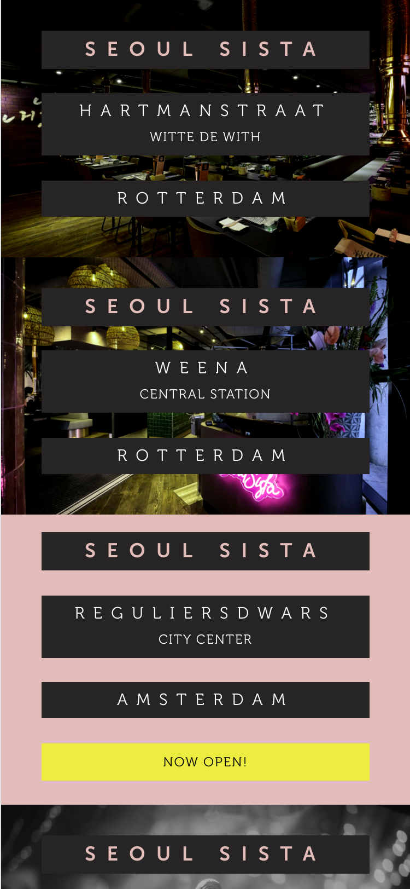
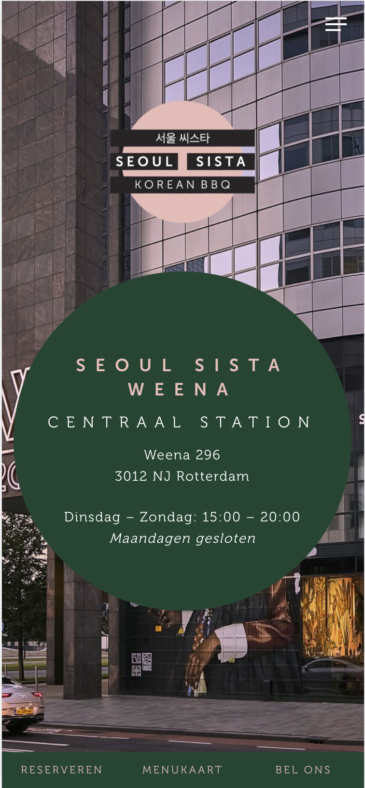
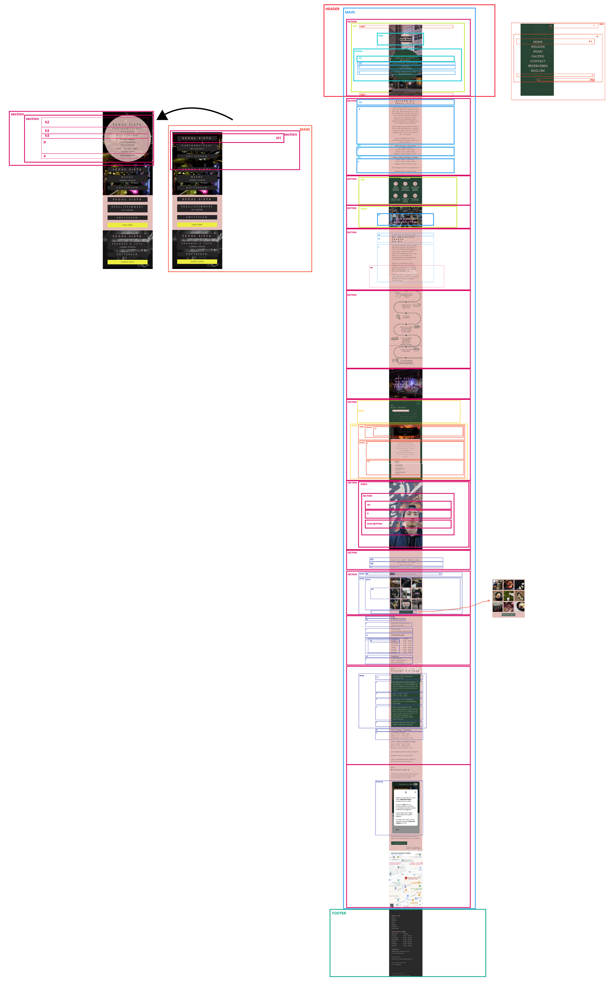
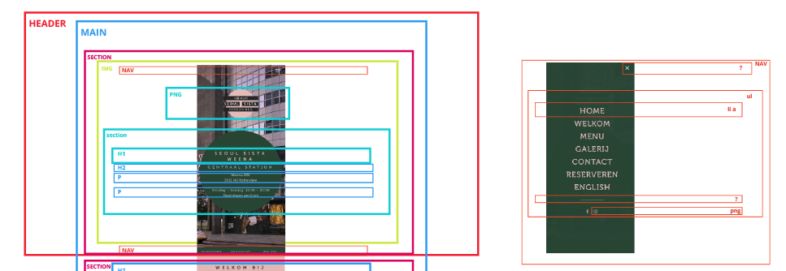
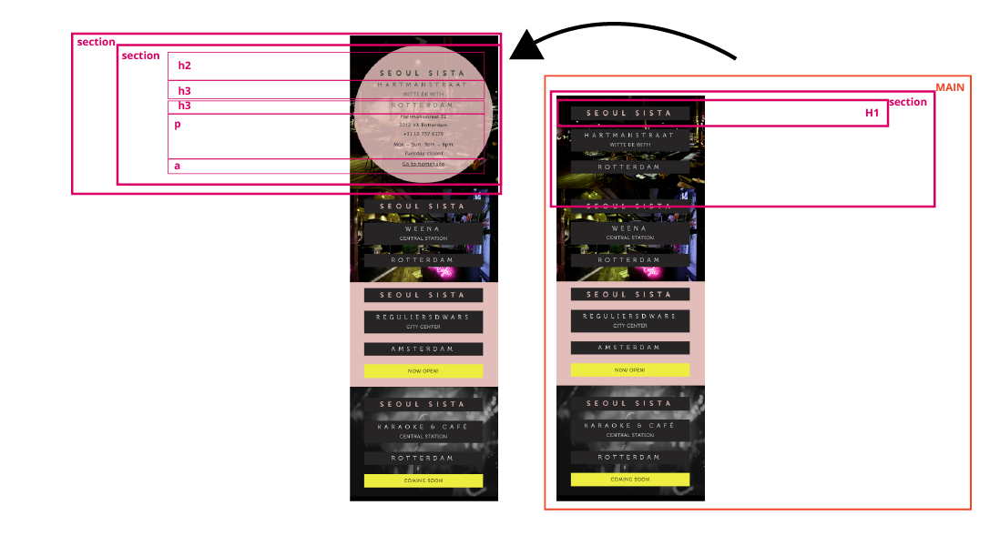
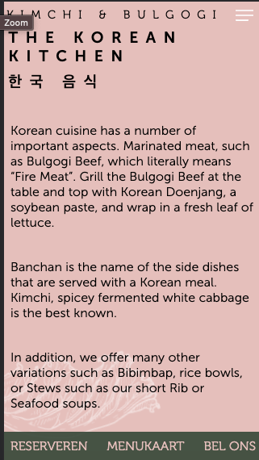

# Procesverslag
Markdown is een simpele manier om HTML te schrijven.  
Markdown cheat cheet: [Hulp bij het schrijven van Markdown](https://github.com/adam-p/markdown-here/wiki/Markdown-Cheatsheet).

Nb. De standaardstructuur en de spartaanse opmaak van de README.md zijn helemaal prima. Het gaat om de inhoud van je procesverslag. Besteedt de tijd voor pracht en praal aan je website.

Nb. Door *open* toe te voegen aan een *details* element kun je deze standaard open zetten. Fijn om dat steeds voor de relevante stuk(ken) te doen.

## Jij

uitwerken voor kick-off werkgroep

### Auteur:
Hong Zhou

#### Je startniveau:
Rood

#### Je focus:
Meer responsive maar surface plane lijkt mij ook heel erg leuk!
 

## Je website

uitwerken voor kick-off werkgroep

### Je opdracht:
https://www.seoulsista.nl/ (homescherm)
https://www.seoulsista.nl/rotterdam-weena/ (specifieke pagina)

#### Screenshot(s) van de eerste pagina (small screen): 
Landingspagina 

#### Screenshot(s) van de tweede pagina (small screen):
Detailpagina 

 

## Breakdownschets (week 1)

uitwerken na afloop 2e werkgroep

### de hele pagina: 

### dynamisch deel (bijv menu): 

### wellicht nog een dynamisch deel (bijv filter): 

## Voortgang 1 (week 2)

uitwerken voor 1e voortgang

### Stand van zaken
Ben bezig met de eerste pagina, het was gelukt om de content erin te plaatsen en nu nog alleen te animeren.

### Agenda voor meeting
samen met je groepje opstellen

| Hong Zhou      | Rosella         | Ilias    | Stefan       |
| ---            | ---                | ---          | ---              |
| transparante animatie in achtergrond | Sections zonder heading | Werken met mediaqueries | a centreren li    |
| google maps op je website | h3 twee woorden apart stylen css | Online fonts en iconen gebruiken | items aan dropdown toevoegen |
| img grijswaarde maken op css| crop images asymmetrisch | Flexbox met één kolom of meerdere beginnen  | lijst onzichtbaar maken met een knop |

### Verslag van meeting
hier na afloop snel de uitkomsten van de meeting vastleggen

- Image grijswaarde maken via grayscale https://codepen.io/robertspier/pen/vYJoajb
- animatie achtergrond : https://codepen.io/robertspier/pen/LYjwBRQ?editors=1010

## Voortgang 2 (week 3)

uitwerken voor 2e voortgang

### Stand van zaken
Zojuist begonnen met het begin van mijn tweede pagina, door de ingewikkelde css vroeg ik me af hoe ik het beste mijn css kon verdelen.

### Agenda voor meeting
samen met je groepje opstellen

| Rosella Moens     | Ilias Ouyaliz       | Hong Zhou    | student 4        |
| ---            | ---                | ---          | ---              |
| Js/css header kruisje/hamburger | Hamburgermenu layout| Mag een tweede css pagina?| en dan ik dat    |
| Css tweede html pagina | Css grid grootte | CSS background image cover centreren?| dit wil ik zeker |
| Hoeveel media queries?| Hoe exact namaken? | Hover van afbeelding naar video| ...              |

### Verslag van meeting
hier na afloop snel de uitkomsten van de meeting vastleggen

- heb een link van Rowin gekregen over video achtergrond maar het is mij niet gelukt om met hover de video te activeren. https://www.w3schools.com/howto/howto_css_fullscreen_video.asp
- met background-position center kon ik mijn afbeeldingen mooi in eht midden centreren waardoor ik verder kon.

## Toegankelijkheidstest (week 4)

uitwerken na test in 8e voortgang

### Bevindingen
Lijst met je bevindingen die in de test naar voren kwamen:

#### Titel eerste bevinding
Hier korte omschrijving (met indien nodig een afbeelding)
Eerste Test, Voiceover, ik kwam erachter dat mijn linkjes niet goed ingeoveogd  zijn.
De content wordt wel goed uitgesproken door de voiceover. 

Hier een omschrijving van hoe het opgelost kan worden.
Mijn navigatie menu was nog een li en er zat nog geen a erin of ervoor waardoor de voiceover het oversloeg. 
Nu heb ik er linkjes van gemaakt en pakt de voiceover ze wel.

#### Titel tweede bevinding. 
Hier korte omschrijving (met indien nodig een afbeelding)
Muis en Toetsenbord, Mijn navigatie wordt momenteel niet gelezen als je er door heen tabt. 
Hier een omschrijving van hoe het opgelost kan worden (met indien nodig een afbeelding)
Hoe het opgelost kan worden is, om er linkjes eraan toe te voegen.

#### Titel volgende bevinding. 
Hier korte omschrijving (met indien nodig een afbeelding)
Contrast mag hoger, met de laag contrast oogziekte is de contrast niet hoog genoeg om de website goed te bezichtigen. Peripheal Field Loss, mijn tekst wat zwart op roze is is niet zo goed te zien door de lage contrast. En wit op roze al helemaal niet.

Hier een omschrijving van hoe het opgelost kan worden (met indien nodig een afbeelding)
Wit niet op roze verwerken, Lettertype grootte bolder maken. Wit op zwart werkt beter voor mensen met een oogbeperking. Een licht naar donker mode.

## Voortgang 3 (week 4)

uitwerken voor 3e voortgang

### Stand van zaken
Ik had moeite met het uitwerken van enkele details van mijn website. Zoals dat ik op een knop druk en er komen 9 foto's eronder. En een animatie voor de hamburger menu

### Agenda voor meeting
samen met je groepje opstellen

| Hong     | Rosella Moens | Ilias   | Stefan     |
| ---            | ---                | ---          | ---              |
| Met Media queries html (img src) aanpassen  | JS animation            | Flexbox en css grid | ACcordion maken  |
| 9 images toevoegen met 1 button| Darkmode colors in root |Logo in het midden | SVG Stroke uitlijnen naar binnen|
| hamburger menu animatie| Footer flexen               | images width  | Pagina's overeenkomen? |

### Verslag van meeting
hier na afloop snel de uitkomsten van de meeting vastleggen

- met display none kan ik de foto's verbergen en ze displayen met button.

## Eindgesprek (week 5)

uitwerken voor eindgesprek

### Stand van zaken
Ik had moeite met de iphone 5se ontwerp ik moest veel padding aangeven voor heel weinig effect: 

### Screenshot(s)

hier screenshot(s) van je eindresultaat

## Bronnenlijst

continu bijhouden terwijl je werkt

Nb. Wees specifiek ('css-tricks' als bron is bijv. niet specifiek genoeg).

1. Tekst in het midden centreren:
https://blog.hubspot.com/website/center-text-in-css
2. Full screen video
https://www.w3schools.com/howto/howto_css_fullscreen_video.asp
3. Changing :hover to touch/click voor mobile devices https://stackoverflow.com/questions/22559756/changing-hover-to-touch-click-for-mobile-devices
4. Css Make a backgorund image scroll slower than everything else:
https://stackoverflow.com/questions/29240028/css-make-a-background-image-scroll-slower-than-everything-else
5. HTML CSS glowing text animation effects | Happy Diwali 2021:
https://www.youtube.com/watch?v=asv8uirb2R8&ab_channel=OnlineTutorials
6. How to create CSS Animations on Scroll 
https://alvarotrigo.com/blog/css-animations-scroll/

